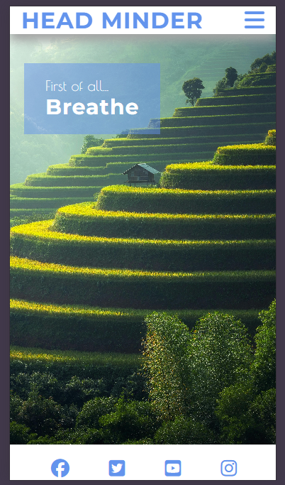
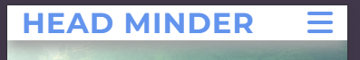
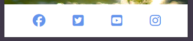
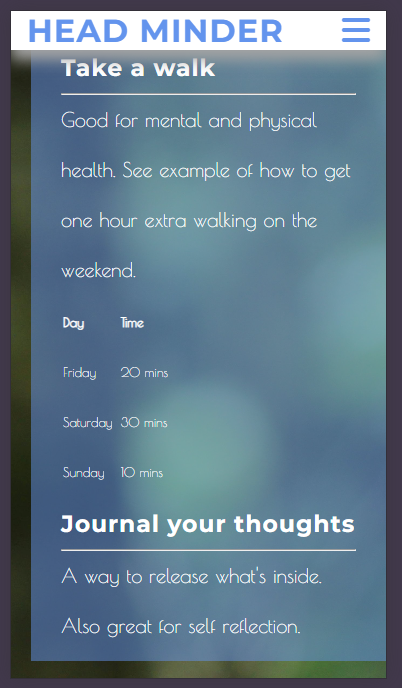
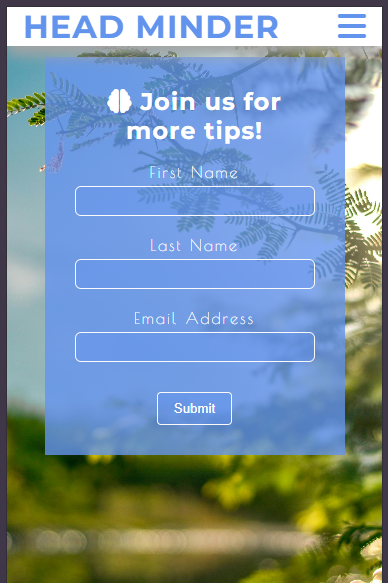
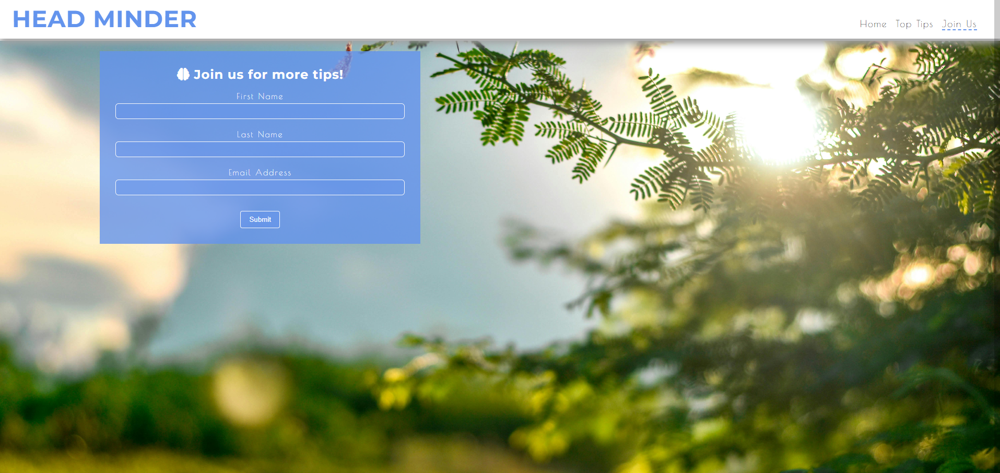

# Head Minder - for mindfulness

This website has been developed to teach people about mindfulness. The home page gives the simple message to first of all, breathe. This sets the tone right from the moment the user first views the page. By being aware of your breathing you can get into a relaxed state of mind which will along with the image of nature give a good user experience.

Target audience can be absolutely anyone as mindfulness and good mental health is something everyone needs to take care of. This website will hopefully be found by people searching the web looking for help and the home page with the clear message in writing should make a good first impression to make them stay and see what the other pages have to offer.

# Features

- ### Navigation Bar
    - All three pages have the same header with a logo and burger icon. Most of it was copied from the Love Running project but the colours have been changed, new fonts were added and the active line under the current viewing page has been changed to a dash.

- ### Footer
    - Footer again is a constant on all three pages for consistenty. It has been copied from the Love Running project with the colour changes to match the blue colour that was selected for this project.

- ### Favicon
    - A favicon was created using [Favicon.io](https://favicon.io/). Again using the same blue colour.

- ### Top Tips page
    - Carrying on the theme from the home page, Top Tips also has a background image of nature but it's not distracting to the text. A partially transparent box has been put over the text too to help increase readability. This page also contains a table to demonstrate how to get an hour of exercise walking in three days. More time on this project could have improved this page. The sections are all in one box but it would look better with separate boxes and would also be easier for responsiveness on different device sizes.

- ### Form page
    - A simple form for people to sign up and recieve more tips to help them. Form looks very well on mobile devices but for larger screens it could be improved, the text above the inputs is centred and with the longer boxes this would look better left aligned. All inputs have been tested, text must be added to First Name and Last Name, and an email adress must be added to final input

